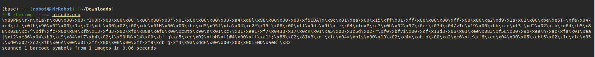

 


# QR Code CTF Challenge Write-up

## Challenge Overview

The challenge involved extracting a flag from a given QR code image. The steps involved decoding the QR code, processing the embedded data, and extracting the final flag.


## Steps Taken to Solve the Challenge

### Step 1: Download the Challenge File

The challenge provided a QR code image file named `qrcode.png`. The first step was to download this image.

### Step 2: Scan the Initial QR Code

To extract the data embedded in the QR code, I used the `zbarimg` tool with the `--raw` option:

```bash
zbarimg --raw qrcode.png
```



- The output was binary data starting with `\x89PNG`, indicating that it was a PNG image.
### Step 3: Extract the Embedded PNG Image

The raw data extracted in Step 2 was used to create a Python script that saved the binary data to a new file, `extracted.png`. The Python script was as follows:

```python
# Python script to save the extracted binary data as a PNG file
bin_data = b'\x89PNG\r\n\x1a\n\x00\x00\x00\rIHDR\x00\x00\x00...\x00\x00\x00IEND\xaeB`\x82
with open("extracted.png", "wb") as file:     
	file.write(bin_data)
	file.close()
```

- The `bin_data` variable contained the binary data output from Step 2.


### Step 4: Scan the Extracted PNG for the Flag

Once the PNG file was saved, I used `zbarimg` again to scan the newly created image:

```bash
zbarimg --raw extracted.png
```


- This produced the output: `flag{01c6e24c48f48856ee3adcca00f86e9b}`, which was the flag for the challenge.


